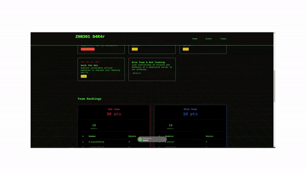

# 📅 **Event Management App**


This application allows you to manage upcoming events, display upcoming events, add new users, and distribute points on an admin dashboard.

The application is composed of two parts:
- **Frontend**: HTML, CSS, and JavaScript for display and user interaction.
- **Backend**: Node.js with Sequelize (ORM) connected to an SQLite database to store user and event data.

## 🚀 **Features**
1. **Display Upcoming Events**  
   The application displays upcoming events every Thursday, allowing users to stay updated on the latest activities.

2. **Admin Dashboard**  
   The admin can add new users and distribute points through a secure dashboard.

3. **User Management**  
   Administrators can register new users and manage them easily through the dashboard.

4. **Points Distribution**  
   Administrators can assign points to users as a reward for their participation or performance.

## 🛠 **Technologies Used**

- **Frontend**: HTML, CSS, JavaScript
- **Backend**: Node.js, Express
- **Database**: SQLite with Sequelize ORM
- **Authentication**: JWT for session management
- **Password Hashing**: SHA256

## 🏁 **Prerequisites**

Before you begin, make sure you have the following installed:

- [Node.js](https://nodejs.org/) - Version 12 or later
- [SQLite](https://www.sqlite.org/index.html) - Lightweight database used to store data
- [Sequelize](https://sequelize.org/) - ORM to interact with SQLite

## 📥 **Installation**

### 1. Clone the repository
```bash
git clone https://github.com/alpapie/z0n301_ctf.git
cd server
```

### 2. Install dependencies
Install the necessary dependencies by running:
```bash
npm install
```

### 3. Set up your database

The application uses SQLite. The configuration is ready to go. You can create or regenerate the SQLite database with the following Sequelize commands:


```bash
npx sequelize-cli db:create
npx sequelize-cli db:migrate
```

### 4. Start the application

Start the Node.js server with:

```bash
npm start
```

The application will be accessible at:

```bash
http://localhost:3000
```

🔐 **Authentication and Security**
----------------------------------

The app uses **JSON Web Tokens (JWT)** for managing user sessions. When a user logs in, a JWT token is generated to authenticate future requests. The token is valid for 24 hours.

⚙️ **Configuration**
--------------------

The following environment variables are required:

-   `JWT_SECRET`: Secret key to sign JWT tokens
-   `FORM_TOKEN`: Validation token for certain admin actions

Make sure to configure these in your `.env` file before starting the server.

### Example `.env` file:

```bash 
JWT_SECRET=your_jwt_secret
FORM_TOKEN=your_form_token
```

📞 **Contribute**
-----------------
If you'd like to contribute to this project, feel free to open an **issue** or submit a **pull request**. All contributions are welcome!
----------------